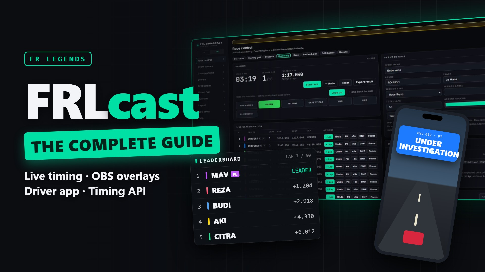
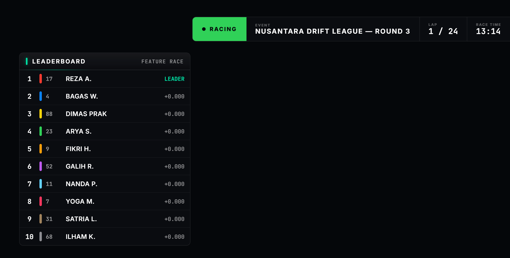

# FRLcast

Race control, live timing, and OBS overlays for FR Legends leagues. One console runs the
whole session: timing, flags, penalties, a championship, a driver phone app, an audience
poll, a spoken commentator, and the official FR Legends timing API. Overlays are ready made
Browser Sources, and every flag reaches the drivers' phones.

- Website: [frlcast.my.id](https://www.frlcast.my.id)
- Video tutorial: [watch on YouTube](https://youtu.be/9SToAYhZ0zY) (13 min, English)
- Desktop app (full features): [download the latest release](https://github.com/kinkpedil/FRLcast/releases/latest) · [what's new in each version](https://frlcast.my.id/changelog)
- Built by kinkpedil12 (Fadly Alfarizy)

## Video tutorial

The complete guide, from creating your first event to going live: the operator console,
OBS overlays, the audience pages, live timing on the desktop app, the official timing API,
and the driver app. Click the thumbnail to watch.

[](https://youtu.be/9SToAYhZ0zY)



## What it is

Three ways to run it:

1. **Desktop app (recommended for a full event).** Download the release, unzip, and run
   `start.cmd`. Nothing to install: Node and the Piper commentary voice are bundled. This
   runs the complete local system, including the things a static website cannot do:
   automatic timing, driver edits, the natural commentary voice, and the official timing API.
2. **From source (developers).** `npm install` then `npm start`, open `http://localhost:4700`.
3. **Hosted (lightweight).** The website at frlcast.my.id runs an event, the audience poll,
   the public pages, and the driver app through Vercel and Supabase. The heavy features
   (commentary, fully automatic timing) are desktop only.

## Features

- **Timing.** Live classification with gaps, last lap and best lap, predicted running order
  between crossings, pit and DNF and Retired, CSV results export.
- **Race control.** Formation, green, yellow, safety car, VSC, red, chequered. Automatic
  flags for stopped cars, time penalties, drive throughs, warnings, disqualification, and
  stewards' investigations.
- **Broadcast overlays.** Leaderboard, timing tower, gap, lower third, results, track map,
  battle, bracket, and more, in one OBS Browser Source. Eleven skins, ten themes, scene
  transitions, and your league logo.
- **Spoken commentator.** A generated commentary track with two voice engines: the browser
  voice (free, offline) or **Piper**, a natural neural voice that runs locally, with an
  in-console installer for many languages.
- **Official timing API.** Reads laps straight from the FR Legends game server (the accurate
  source), matched to your drivers and fed into the same timing the overlays use.
- **Audience poll.** Custom or preset polls, voted from the public live page, tallied on the
  overlay, and saved to the race recap.
- **Driver phone app.** Android app: drivers sign in, see their flags and penalties in a
  floating window over the game, and send team radio.
- **Vision tracking.** Optional computer vision on the in-game minimap for live positions and
  overtakes when the official API is not in use. No ML model required.

## Quick start

**Operators:** download the [desktop app](https://github.com/kinkpedil/FRLcast/releases/latest),
unzip anywhere, and double-click `start.cmd`. The console opens in its own window. Add the
overlay as an OBS Browser Source at `http://localhost:4700/overlay/all.html` (1920x1080).

**Developers:**

```bash
npm install
npm start                 # http://localhost:4700
npm run fetch-tessdata    # once, for fully offline OCR
```

## Project layout

| Path | What |
|---|---|
| `server/` | Express + WebSocket server: authoritative timing, driver auth, Piper TTS, and the official timing API poller. |
| `public/` | The operator console and the OBS overlay pages (served by the server). |
| `site/` | The static website (landing, login, dashboard, public pages), deployed to Vercel. |
| `android/` | The driver phone app, built with the raw Android SDK tools. |
| `supabase/` | Database schema and migrations for the hosted mode. |
| `scripts/` | Packaging (`package-desktop.ps1`), the launcher helper, and setup scripts. |
| `remotion/` | The video tutorial and its thumbnail, built with Remotion (narration and sound in `remotion/scripts/audio`). |

## Documentation

- [docs/OPERATOR.md](docs/OPERATOR.md): the full operator guide (setup, vision calibration,
  OBS, performance, and the honest limitations). In Indonesian.
- [SETUP.md](SETUP.md): putting the hosted site online (Vercel + Supabase).
- [TRAINING.md](TRAINING.md): training an optional custom detection model.

## Notes

- The local server is built for a trusted LAN and has no authentication. Run the desktop app
  locally; do not expose it on a public IP without a reverse proxy and auth.
- The Supabase anon key in the site config is public by design (row level security decides
  access); the timing API key and TLS keys are kept out of the repository.
